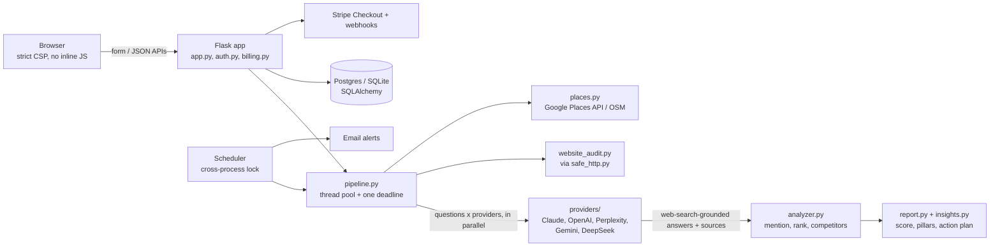

# AI Visibility Monitor

[](https://github.com/Pathik0007/ai-visibility-monitor/actions/workflows/ci.yml)

**Do ChatGPT, Claude, Perplexity, Gemini and DeepSeek recommend your business?**
AI Visibility Monitor asks them the questions your customers ask ("best
dentist in Ryde for nervous patients?"), shows who they recommend instead,
where they got their information, and what to fix. It covers your Google
profile, your reviews and your website. Subscribers get automatic re-checks
and an email when something changes.

**Live app:** <https://YOUR-REAL-NAME.onrender.com>, deployed on Render with Postgres.

---

## What a business owner gets

- **A visibility score across 5 assistants.** Each one is asked 6–15
  realistic, niche-specific questions, located where the customer is.
- **Who is recommended instead**, what each assistant said about them, and
  the web pages it read to decide.
- **An action plan for each foundation:** Google/Bing/Apple listings,
  reviews, and the website. Each step is tied to the exact question where
  the business was missed.
- **A website AI-readiness check.** Can AI search crawlers reach the site?
  Is the business name, suburb, phone and opening hours in plain text? Is
  there structured data? It's also available as a free stand-alone tool at
  `/website-check`.
- **Pro plan:** a live Google Business Profile benchmark against the
  businesses that win, custom questions, and CSV export.

## Architecture



| Layer | Where | Notes |
|---|---|---|
| Web app | `app.py`, `auth.py`, `billing.py`, `templates/`, `static/` | Flask 3, Jinja, Flask-Login, Flask-WTF CSRF, Flask-Limiter |
| AI providers | `ai_visibility/providers/` | One module per assistant behind a common interface. Retries, a per-provider concurrency cap, and deadline-bounded timeouts live in `base.py`. |
| Check pipeline | `ai_visibility/pipeline.py` | Runs every question × provider call concurrently, under one overall deadline |
| Answer analysis | `ai_visibility/analyzer.py`, `report.py`, `insights.py` | Name matching, rank, negative mentions, competitor merging, scoring |
| Domain knowledge | `niches.py`, `categories.py`, `category_match.py` | About 28 business niches with their customers' real questions, listing platforms by country, and fixes |
| Location & business search | `places.py`, `search_engine.py`, `links.py` | Google Places API (New) with an OpenStreetMap fallback, query understanding, Google Maps link parsing |
| Website check | `website_audit.py`, `safe_http.py` | Robots.txt rules as crawlers apply them (RFC 9309), a linear-time HTML parser, SSRF-safe fetching |
| Persistence | `models.py`, `report_cache.py` | SQLAlchemy models, forward-only migrations, database-backed shareable reports |
| Background work | `alerts.py`, `scheduled_job.py`, `locks.py` | Scheduled re-checks, change detection, email alerts. A run happens once across workers. |

## Engineering highlights

- **External AI integrations with live web search.**
  - Claude uses the `web_search` tool with the customer's approximate location.
  - OpenAI uses the Responses API with `web_search` and returns the sources it consulted.
  - Perplexity uses `user_location`.
  - Gemini is grounded on Google Search *and* Google Maps at the customer's coordinates, and falls back to Search only if Maps grounding is rejected.
  - DeepSeek answers from training data, and the report says so.
  - Model IDs are environment variables, because providers retire models.
- **Concurrency.**
  - Every question × provider call runs in parallel on a thread pool, under one deadline that starts before geocoding.
  - Providers read the remaining time to cap their own timeouts and retries, so calls that miss the deadline stop instead of running (and billing) on.
  - A bounded semaphore per provider keeps bursts under rate limits.
- **Failure handling that protects the score.**
  - Failed, empty, refused or truncated answers (`pause_turn`, `status: incomplete`, `content: null`) are *errors*, excluded from scoring. They are never counted as "not mentioned".
  - A provider whose calls all failed is never called "weak".
  - 429/5xx responses are retried with backoff, honouring `Retry-After`.
- **Authentication and access control.**
  - Hashed passwords and session cookies (`Secure`, `SameSite=Lax`).
  - Every business route is scoped to the logged-in owner (tested for IDOR).
  - CSRF tokens on every form.
  - Plan limits are enforced server-side under a per-user lock.
- **Payments.**
  - Stripe Checkout activates a plan only after Stripe confirms a paid checkout and a live subscription.
  - Webhooks are signature-verified, re-fetch the current subscription state (events can arrive out of order), and ignore events for older subscriptions.
- **SQL persistence.** SQLAlchemy runs on SQLite locally and Postgres in production. Migrations are forward-only and serialised with a Postgres advisory lock, so workers booting together can't race.
- **Rate limiting.** Per IP for anonymous checks, per user for paid re-runs, tighter limits on login/signup. The Stripe webhook is exempt.
- **Security.**
  - Strict Content-Security-Policy (no inline scripts) and HSTS.
  - Secrets are scrubbed from any error text shown to users. `/healthz` exposes no database details.
  - Visitor-supplied URLs go through `safe_http.py`:
    - no `user@host` tricks and only ports 80/443;
    - DNS is resolved once *inside* the socket connect, and only public IPs are allowed (blocks DNS rebinding, IPv4-mapped IPv6, NAT64, CGNAT, link-local metadata);
    - every redirect is re-checked;
    - each fetch has one deadline and a size cap.
- **Geocoding and location logic.**
  - Location text is geocoded to drive search bias and each assistant's "where is the customer" setting.
  - Business search splits "nene chicken macquarie centre" into *what* and *where*.
  - Results are re-ranked by text match and distance.
  - Different branches of a chain are kept apart.
- **Production deployment.**
  - Gunicorn with threaded workers on Render. The workload is I/O-bound, so one worker × 8 threads keeps in-memory rate-limit counters exact.
  - Runs behind `ProxyFix`, so client IPs and HTTPS URLs are correct.
  - A health check, and refuses to start in production without a real secret key.

## Production problems found and fixed

Some of the bugs below only appeared on the real multi-worker deployment or
with real data. The full pass-by-pass record is in
[`docs/ENGINEERING_LOG.md`](docs/ENGINEERING_LOG.md).

| Problem | Root cause | Fix |
|---|---|---|
| Every shared report link said "expired" on Render | Reports were cached in a per-process dict, so the POST and the redirected GET landed on different Gunicorn workers | Store reports in the database, shared by all workers |
| Scores dropped when an API had a bad day | Failed or empty provider calls were counted as "not mentioned" | Treat them as errors, exclude them from the score, and say so on the report |
| Autocomplete showed results for an old query | A slow response arrived after a newer one and overwrote it | Sequence-number guard on every fetch, and no caching of failed lookups |
| Each business checked and emailed twice | Each Gunicorn worker started its own scheduler | Cross-process lock (Postgres advisory lock or file lock) around the run |
| Pasted "Maps" link could reach internal addresses | `maps.google.com:@169.254.169.254` passed the host check, because the part before `@` is a username | Compare the parsed hostname, reject userinfo and non-standard ports, and use a guarded connection |
| A hostile website could freeze a worker | Backtracking regexes on HTML (a 7 KB page took more than a second; growth was roughly cubic) | One linear `html.parser` pass |
| Abandoned Stripe checkout could unlock Pro | The success page trusted any checkout session id that belonged to the user | Require a paid, complete session and a live subscription |
| "Dr. Kim Dental" never counted as mentioned | Sentence splitting cut the name at "Dr." | Handle abbreviations when splitting sentences |

## Run it locally

```bash
python -m venv .venv && source .venv/bin/activate
pip install -r requirements-dev.txt
cp .env.example .env          # optional: everything runs without keys
python app.py                 # http://localhost:5000
```

With no keys, every assistant returns clearly labelled *sample* answers.
Billing runs in demo mode and alert emails go to `alerts_outbox.log`, so
the whole flow works with zero setup.

## Tests

```bash
python -m pytest              # 169 tests, about 7 s, no network or API keys needed
```

The suite covers:

- answer analysis and scoring;
- provider failure modes, including retries, deadlines, and empty or cut-off answers;
- SSRF protection, run against a real local HTTP server (including DNS rebinding and slow-drip responses);
- robots.txt rules;
- Stripe flows with real `StripeObject` instances;
- access control, plan limits, and scheduler locking.

CI runs it on every push (`.github/workflows/ci.yml`).

## Configuration

All settings are environment variables. See `.env.example` for the full list.

| Variable | Purpose |
|---|---|
| `FLASK_SECRET_KEY` | Required in production |
| `DATABASE_URL` | Postgres in production (SQLite by default) |
| `ANTHROPIC_API_KEY`, `OPENAI_API_KEY`, `PERPLEXITY_API_KEY`, `GOOGLE_API_KEY`, `DEEPSEEK_API_KEY` | The assistants checked. A missing key means sample answers for that assistant. |
| `CLAUDE_MODEL`, `OPENAI_MODEL`, `PERPLEXITY_MODEL`, `GEMINI_MODEL`, `DEEPSEEK_MODEL` | Model overrides |
| `GOOGLE_PLACES_API_KEY` | Google business search and the Pro profile benchmark (OpenStreetMap if unset) |
| `STRIPE_SECRET_KEY`, `STRIPE_PRICE_ID`, `STRIPE_PRICE_ID_PRO`, `STRIPE_WEBHOOK_SECRET` | Billing |
| `SMTP_HOST`, `SMTP_PORT`, `SMTP_USER`, `SMTP_PASS`, `ALERT_FROM_EMAIL` | Alert emails |
| `COMPLIMENTARY_EMAILS` | Owner/test accounts that get Pro free (comma-separated) |
| `CHECK_TIMEOUT`, `PROVIDER_TIMEOUT`, `PROVIDER_CONCURRENCY` | Deadline and throughput tuning |
| `RATELIMIT_STORAGE_URI` | Shared rate-limit store (e.g. Redis) if you scale past one worker |
| `ENABLE_INPROCESS_SCHEDULER` | `0` if a host cron runs `scheduled_job.py` instead |

## Deploying (Render)

1. Create a Web Service from this repo.
   - Build command: `pip install -r requirements-prod.txt`
   - Start command: the line in `Procfile`.
2. Add a Render Postgres database and set `DATABASE_URL`. Set `FLASK_SECRET_KEY`
   (`python -c "import secrets; print(secrets.token_hex(32))"`).
3. Add the API keys as environment variables only, never in the repository.
4. Point an uptime monitor at `/healthz`.

## Scope and honesty

- AI answers vary from run to run, and no outside tool can see *why* a model chose a business. The report therefore shows what was asked, what was answered and which sources were read, and frames its advice as evidence-based guidance, not a guarantee.
- Sample answers are always labelled as sample answers.
- Not built yet: password-reset emails, team accounts, white-label PDF reports.
